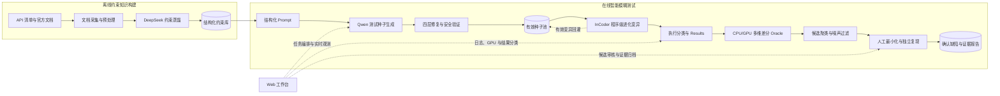
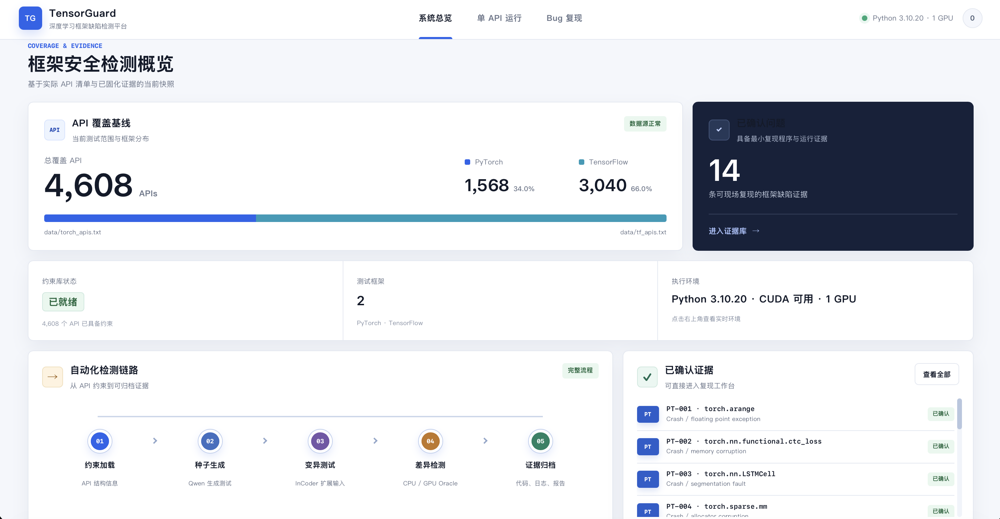
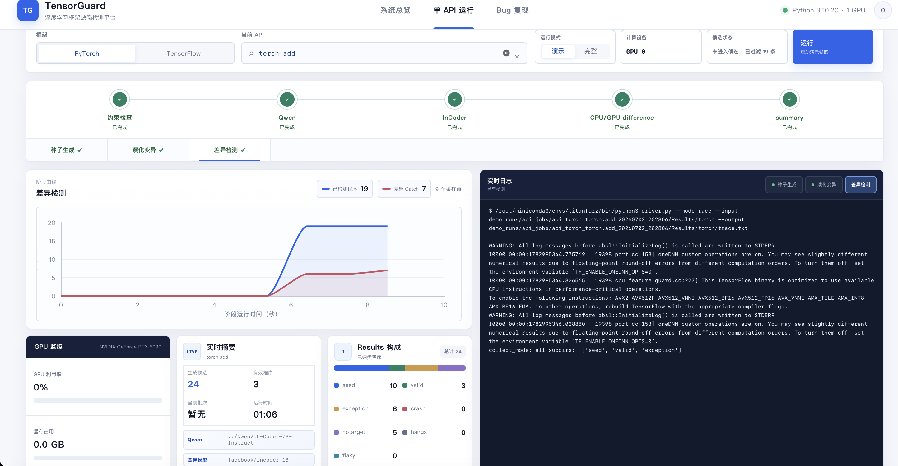
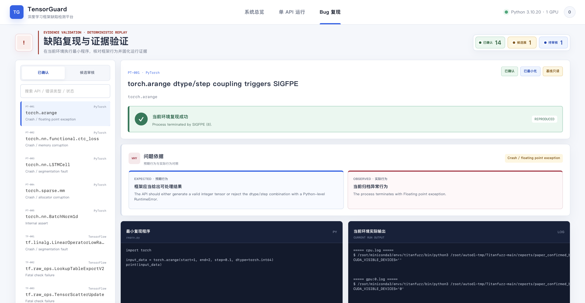
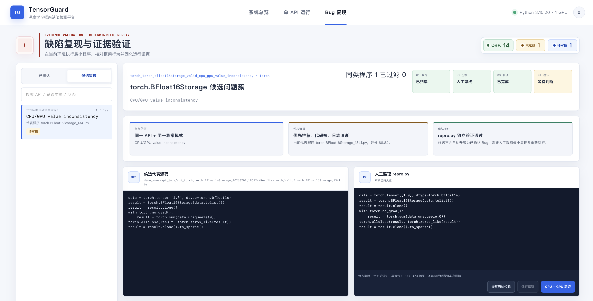
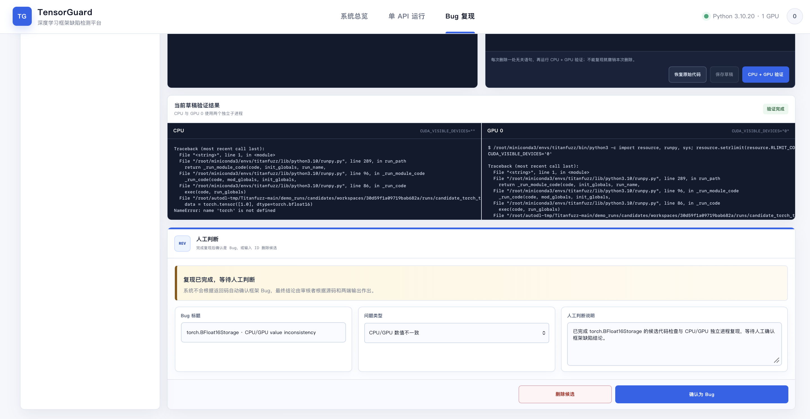
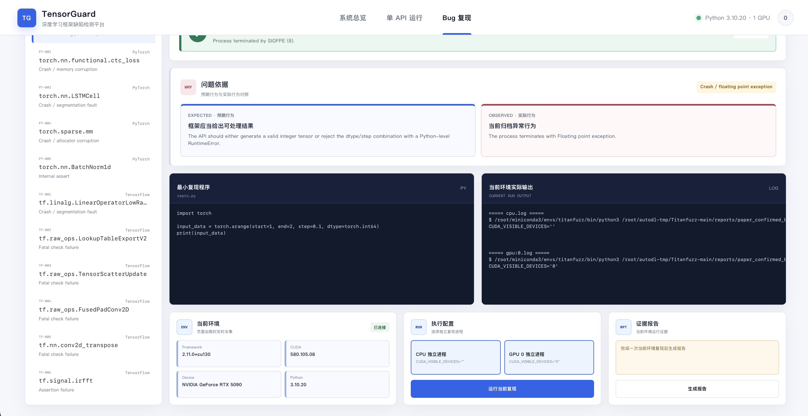

<div align="center">

# TensorGuard

### 基于大语言模型的深度学习框架智能模糊测试与缺陷验证平台

从 API 文档约束、测试程序生成和进化式变异，到 CPU/GPU 差分检测、候选复核与证据归档的一体化框架安全测试系统。

[](#环境与模型)
[](#环境与模型)
[](#环境与模型)
[](#系统规模)
[](#系统规模)

[系统架构](#系统架构) · [核心创新](#七项核心创新) · [快速开始](#快速开始) · [界面展示](#界面展示) · [项目结构](#项目结构)

</div>

---

## 项目简介

TensorGuard 面向 PyTorch、TensorFlow 等深度学习框架 API，自动构造能够独立执行并触达目标 API 的 Python 测试程序。与面向字节流的传统模糊测试不同，系统显式处理 `shape`、`dtype`、取值范围、设备后端和跨参数关系等高层语义约束，并通过程序级变异持续探索更复杂的调用序列与中间状态。

系统不把一次异常直接判定为框架 Bug。检测结果需要依次经过 CPU/GPU 差分预言、错误特征聚类、噪声过滤、人工最小化和独立进程复现，最终沉淀为包含最小复现程序、环境快照、运行输出和证据报告的可复核条目。

> **项目定位：** TensorGuard 既是深度学习框架模糊测试引擎，也是将高噪声实验结果转化为可追踪、可复现证据的工程工作台。

## 系统规模

| 测试对象 | 当前规模 | 数据来源 |
| --- | ---: | --- |
| PyTorch API | 1,568 | `data/torch_apis.txt` |
| TensorFlow API | 3,040 | `data/tf_apis.txt` |
| API 总覆盖基线 | 4,608 | 两套框架 API 清单 |
| 可复现证据 | 14 | `reports/paper_confirmed_bugs/` |

上述数字对应当前仓库快照。候选事件、差分 Catch 和确认缺陷采用不同统计口径，原始异常数量不直接等同于框架 Bug 数量。

## 系统架构

TensorGuard 由离线约束知识构建和在线自动化测试两部分组成。DeepSeek 用于离线蒸馏 API 文档约束；实际测试时直接读取固定约束库，由本地 Qwen 生成种子，再进入修复、验证、变异和差分检测链路。



完整数据链路为：

```text
约束蒸馏 → 种子生成 → 质量修复 → 有效种子池 → 进化变异
        → 执行分类 → 差分检测 → 候选复核 → 证据归档
```

各阶段以 API 全限定名为主键，分别保存约束、种子、`Results`、`trace`、候选工作区和确认记录。阶段之间通过文件与状态接口衔接，可以单独重跑，同时不会覆盖已经固化的候选证据。

### 核心模块与职责

| 阶段 | 主要实现 | 输入 | 输出 |
| --- | --- | --- | --- |
| 约束知识构建 | `prompt_iput.py`、`constraint.py`、`experiment/` | API 文档与签名 | 结构化参数约束和跨参数约束 |
| 种子生成与质量修复 | `qwen_seed.py` | 约束、Prompt、本地 Qwen | `raw seeds`、`fixed seeds`、有效种子 |
| 进化式变异 | `ev_generation.py`、`model.py`、`util/` | 有效种子池、变异策略 | `valid`、`exception`、`crash` 等分类程序 |
| 差分检测 | `torch2cuda.py` | 同一测试程序 | CPU/GPU 执行状态、异常、类型与数值差异 |
| 批量调度与 Trace | `driver.py`、`scripts/` | API 范围、时间与样本预算 | `Results`、`trace.txt`、任务摘要 |
| 候选审核与证据归档 | `webapp/candidates.py`、`webapp/confirmed_bugs.py` | 差分事件、源码、日志和环境 | 候选簇、最小复现、确认记录与报告 |
| 可视化工作台 | `webapp/server.py`、`webapp/frontend/` | 状态文件、日志、结果目录 | 系统总览、单 API 运行、Bug 复现与审核页面 |

## 七项核心创新

TensorGuard 的创新不是一次模型调用，而是一条能够持续运行、度量和复核的智能模糊测试链路。

| # | 创新方向 | 核心方法 | 解决的问题 |
| ---: | --- | --- | --- |
| 1 | **结构化约束蒸馏** | 从 API 文档提取参数级约束与跨参数关系，形成可校验、可续作、可复用的知识层 | 随机生成不了解 `shape`、`dtype`、范围和参数依赖 |
| 2 | **约束驱动的 LLM 种子生成** | 将分步骤任务、完整签名和结构化约束统一注入 Prompt，生成短小、自包含且命中目标 API 的程序 | 低频和复杂 API 容易得到形式合理但不可执行的样本 |
| 3 | **四层递进式程序修复** | 静态清洗、语法修复、递归裁剪、错误反馈重生成按成本递进执行 | 模型输出局部错误时直接丢弃，浪费已正确的输入构造与调用逻辑 |
| 4 | **面向 API 难度的自适应重采样** | 根据有效种子缺口动态调整后续采样数量和温度，达到阈值或轮数上限即停止 | 固定预算导致简单 API 过采样、复杂 API 被过早跳过 |
| 5 | **程序级进化变异与适应度搜索** | 在有效程序上进行局部 mask 与填充式变异，以数据流深度、唯一 API 调用数和重复惩罚引导父代选择 | 字节级扰动破坏 Python 语义，随机父代反复探索低价值路径 |
| 6 | **多维 CPU/GPU 差分检测** | 联合比较执行状态、异常语义、变量类型和容差数值，构造无需人工标准答案的测试预言 | 深度学习 API 输出规模大、随机与浮点计算使标准答案难构造 |
| 7 | **候选复核与证据归档闭环** | 按 API 和错误特征聚类，保留源码、日志和环境，支持人工最小化、独立复现、确认、删除与报告生成 | 原始异常混有非法输入、随机性和测试程序错误，无法直接作为框架 Bug |

四层修复与自适应重采样均支持消融配置，便于独立评估结构化约束、程序修复和采样策略对有效率的贡献。

## 功能概览

- **约束知识层**：离线保存 API 文档蒸馏结果，支持完整性检查和固定约束库索引。
- **本地模型生成**：使用本地 Qwen2.5-Coder 生成测试种子，不依赖在线推理接口。
- **安全执行与验证**：子进程隔离、超时控制、目标 API 命中检查和代码去重。
- **进化式搜索**：InCoder 填充式变异、适应度种子选择和有效变异回灌。
- **结果分类**：统一保存 `seed`、`valid`、`exception`、`crash`、`notarget`、`hangs` 和 `flaky`。
- **差分 Oracle**：对同一框架的 CPU/GPU 后端进行多维行为比较并生成 Catch。
- **候选审核**：自动聚类与过滤后，支持人工编辑 `repro.py` 和 CPU/GPU 独立复现。
- **证据管理**：确认条目包含稳定 Bug ID、最小复现程序、环境信息、两端输出和报告。
- **Web 展示**：系统总览、单 API 完整链路、实时日志、GPU 监控、候选审核和 Bug 复现。

## 界面展示

### 系统总览

<p align="center">
  
</p>

总览页读取当前 API 清单、确认缺陷索引和运行环境，展示覆盖基线、自动化检测链路与可复现证据。

<table>
  <tr>
    <td width="50%" valign="top">
      <br>
      <sub><b>单 API 运行：</b>阶段状态、实时曲线、完整日志、GPU 监控与 Results 分类。</sub>
    </td>
    <td width="50%" valign="top">
      <br>
      <sub><b>确认缺陷复现：</b>最小复现代码、预期/实际行为、当前环境输出与证据状态。</sub>
    </td>
  </tr>
  <tr>
    <td width="50%" valign="top">
      <br>
      <sub><b>候选审核：</b>按 API 和错误特征聚类，选择代表程序并编辑人工最小复现。</sub>
    </td>
    <td width="50%" valign="top">
      <br>
      <sub><b>证据确认：</b>CPU/GPU 独立进程验证、问题类型标注、确认归档或删除候选。</sub>
    </td>
  </tr>
</table>

<details>
<summary>查看更多复现页细节</summary>

<p align="center">
  
</p>

</details>

## 快速开始

### 环境与模型

| 组件 | 当前实验环境 | 说明 |
| --- | --- | --- |
| Python | 3.10 | 推荐使用独立 Conda 环境 |
| PyTorch | 2.11.0+cu130 | 按所用 CUDA 和显卡安装匹配构建 |
| TensorFlow | 2.21.0 | GPU 运行需提供兼容的 CUDA/cuDNN 动态库 |
| 种子模型 | Qwen2.5-Coder-7B-Instruct | 默认从本地目录加载 |
| 变异模型 | InCoder-1B / InCoder-6B | 单 API 演示默认 1B；全量脚本默认 6B，可通过参数切换 |

> PyTorch 与 TensorFlow 对 CUDA 运行时的要求不完全相同。迁移环境时请分别验证 `torch.cuda.is_available()` 和 `tf.config.list_physical_devices('GPU')`，不要只依据 `nvidia-smi` 判断。

### 1. 获取代码并创建环境

```bash
git clone https://github.com/TTZTTZ1/TensorGuard.git
cd TensorGuard

conda create -n tensorguard python=3.10 -y
conda activate tensorguard
```

先按服务器 CUDA 环境安装匹配的 PyTorch，再安装其余依赖：

```bash
pip install torch==2.11.0+cu130 \
  --index-url https://download.pytorch.org/whl/cu130
pip install -r requirements.txt
```

模型可以放在数据盘，并通过命令行参数传入。单 API 脚本默认在 `../Qwen2.5-Coder-7B-Instruct` 查找 Qwen 权重；InCoder 既可以使用 Hugging Face 模型名，也可以传入本地目录。

### 2. 启动 Web 工作台

仓库已包含构建后的前端静态文件，启动展示页面不需要额外安装 Node.js：

```bash
python3 webapp/server.py --host 127.0.0.1 --port 8008
```

浏览器访问 `http://127.0.0.1:8008/`。远程服务器可使用 SSH 端口转发访问该地址。

### 3. 运行单个 API 完整链路

```bash
python3 scripts/run_one_api_demo.py \
  --lib torch \
  --api torch.nn.functional.conv1d \
  --out demo_runs/conv1d \
  --mode demo \
  --qwen_model /path/to/Qwen2.5-Coder-7B-Instruct \
  --mut_model facebook/incoder-1B
```

`demo` 与 `full` 调用相同的约束检查、种子生成、进化变异、差分检测和候选归集阶段；区别仅在样本、轮数和时间预算。输出保存在任务目录与 `Results/` 中，状态、阶段日志和候选归集结论可由 Web 工作台实时读取。

仅检查命令、路径和阶段衔接时，可以使用 `--dry_run`；该模式不会加载模型，也不代表真实测试结果。

### 4. 全量 API 运行

```bash
# PyTorch 1,568 个 API
python3 scripts/run_all_apis.py \
  --lib torch \
  --qwen_model /path/to/Qwen2.5-Coder-7B-Instruct \
  --mut_model facebook/incoder-6B \
  --resume

# TensorFlow 3,040 个 API
python3 scripts/run_all_apis.py \
  --lib tf \
  --qwen_model /path/to/Qwen2.5-Coder-7B-Instruct \
  --mut_model facebook/incoder-6B \
  --resume
```

`--resume` 跳过已经完成的 API。多进程运行时需要同时考虑模型显存、框架初始化、子进程验证和磁盘 I/O，worker 数量不应仅按显存余量设置。

### 5. 消融实验

`qwen_seed.py` 提供以下配置：

| 模式 | 配置 |
| --- | --- |
| `full` | 结构化约束 + 四层修复 + 自适应重采样 |
| `no_constraints` | 移除结构化约束 |
| `no_repair` | 仅保留 Layer 1 静态清洗 |
| `no_layer4` | 关闭错误反馈重生成 |
| `no_resample` | 强制单轮采样 |

```bash
python3 qwen_seed.py \
  --library torch \
  --apilist data/torch_apis.txt \
  --out_dir codex_seed_programs/torch-qwen \
  --constraints_dir experiment/torch \
  --model_path /path/to/Qwen2.5-Coder-7B-Instruct \
  --ablation full
```

## 项目结构

```text
TensorGuard/
├── qwen_seed.py                  # 约束驱动种子生成、四层修复、自适应重采样
├── ev_generation.py              # 有效种子池与进化式程序变异
├── torch2cuda.py                 # CPU/GPU AST 转换与差分 Oracle
├── driver.py                     # 批量执行、超时监控与 Trace 汇总
├── model.py                      # Qwen 之外的填充式变异模型封装
├── constraint.py                 # API 约束抽取与结构化处理
├── experiment/                   # 离线蒸馏的结构化约束库
├── data/                         # PyTorch / TensorFlow API 清单与 Prompt 模板
├── config/                       # TensorFlow API 配置
├── util/                         # AST 变换、插桩、种子池和日志工具
├── mycoverage/                   # 隔离执行与覆盖追踪
├── scripts/                      # 单 API、全量与消融实验入口
├── webapp/
│   ├── server.py                 # Web API、任务调度与运行状态
│   ├── candidates.py             # 候选聚类、过滤与持久化
│   ├── confirmed_bugs.py         # 动态确认缺陷归档
│   ├── frontend/                 # Vue 前端源码
│   └── static/                   # 已构建、可直接运行的前端资源
├── reports/
│   ├── paper_confirmed_bugs/     # 14 条基线可复现证据
│   ├── confirmed_bugs/           # 审核后的问题记录
│   └── bug_candidates/           # 候选分析材料
├── screenshots/                  # README 界面截图
└── test/                         # 后端、前端契约与候选复现测试
```

## 结果与证据边界

- `Results/` 保存自动执行产生的分类程序，是实验产物，不是确认缺陷库。
- `trace.txt` 记录差分事件和 Catch，用于聚类与筛选，不应直接按行数统计 Bug。
- `demo_runs/candidates/` 保存从单 API 任务归集出的候选及人工工作区。
- `reports/paper_confirmed_bugs/` 保存当前基线可复现证据；动态确认条目由 Web 工作台独立管理。
- “已复现”表示给定环境中现象稳定出现；是否属于上游框架缺陷仍需结合 API 契约、源码和维护者反馈判断。

## 开发与验证

```bash
# 后端及数据契约测试
python3 -m unittest discover -s test -p 'test_*.py'

# 修改 Vue 前端时
cd webapp/frontend
npm install
npm test
npm run build
```

前端构建产物需要同步到 `webapp/static/`，后端服务才能展示最新版本。

## 开源模型与组件

| 组件 | 用途 |
| --- | --- |
| [Qwen2.5-Coder](https://huggingface.co/Qwen/Qwen2.5-Coder-7B-Instruct) | 约束驱动的测试种子生成与错误反馈修复 |
| [InCoder](https://huggingface.co/facebook/incoder-6B) | 程序局部填充与进化式变异 |
| [DeepSeek](https://github.com/deepseek-ai) | 离线 API 约束蒸馏 |

## 使用说明

本项目用于学术研究、课程实践与安全测试。对第三方框架进行测试和缺陷披露时，请遵循目标项目的安全政策和负责任披露流程。

<div align="center">
  <sub>TensorGuard · Deep Learning Framework Fuzzing and Evidence Validation</sub>
</div>
